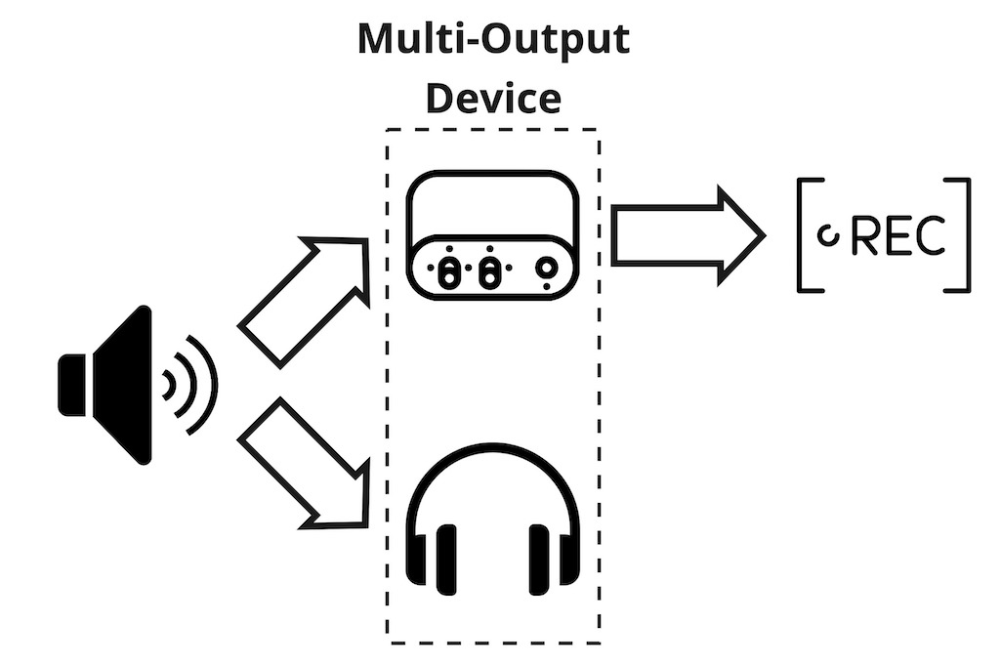
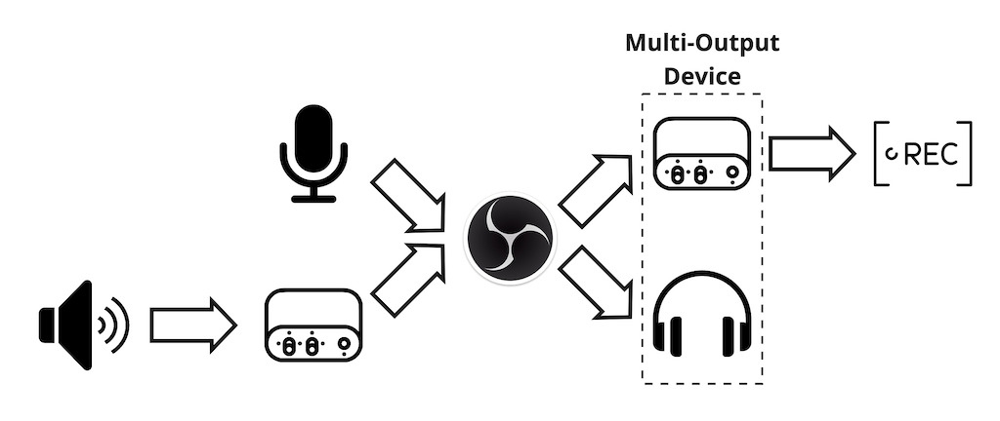
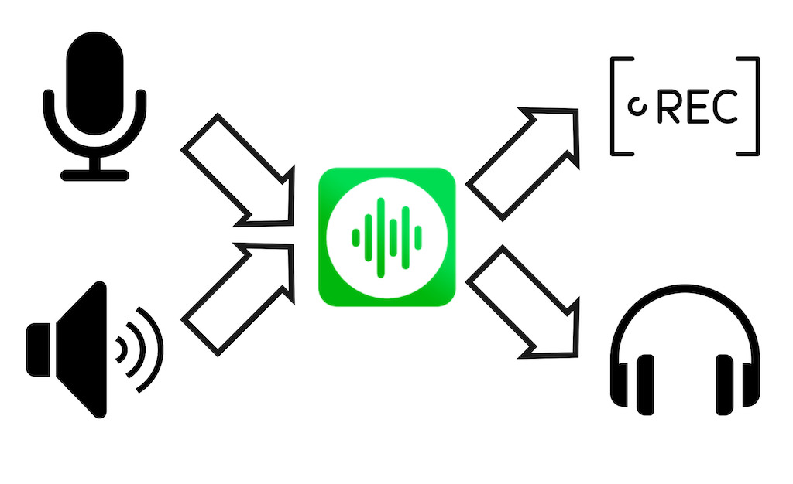
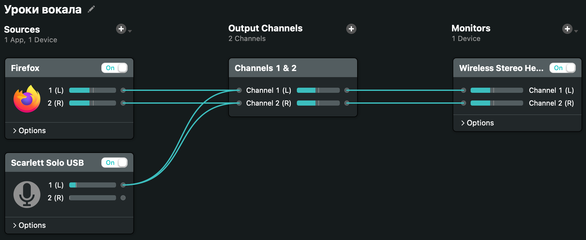
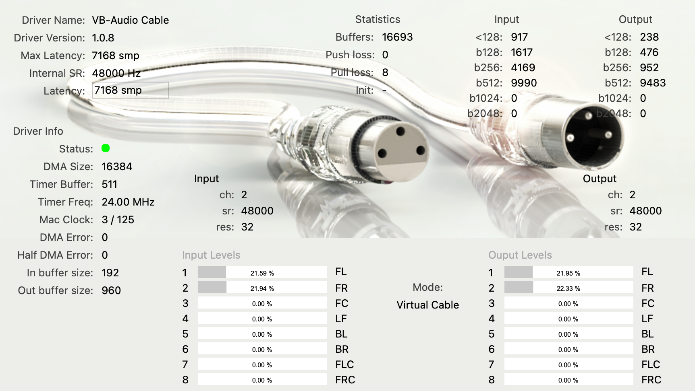
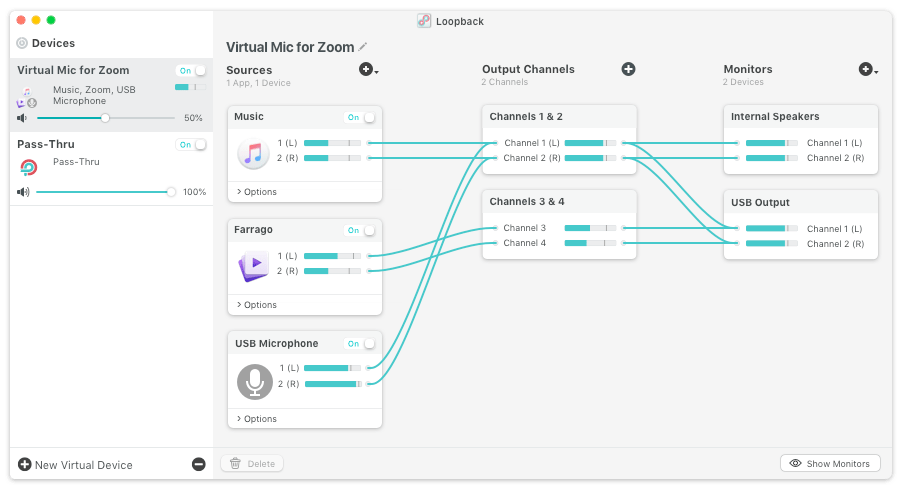
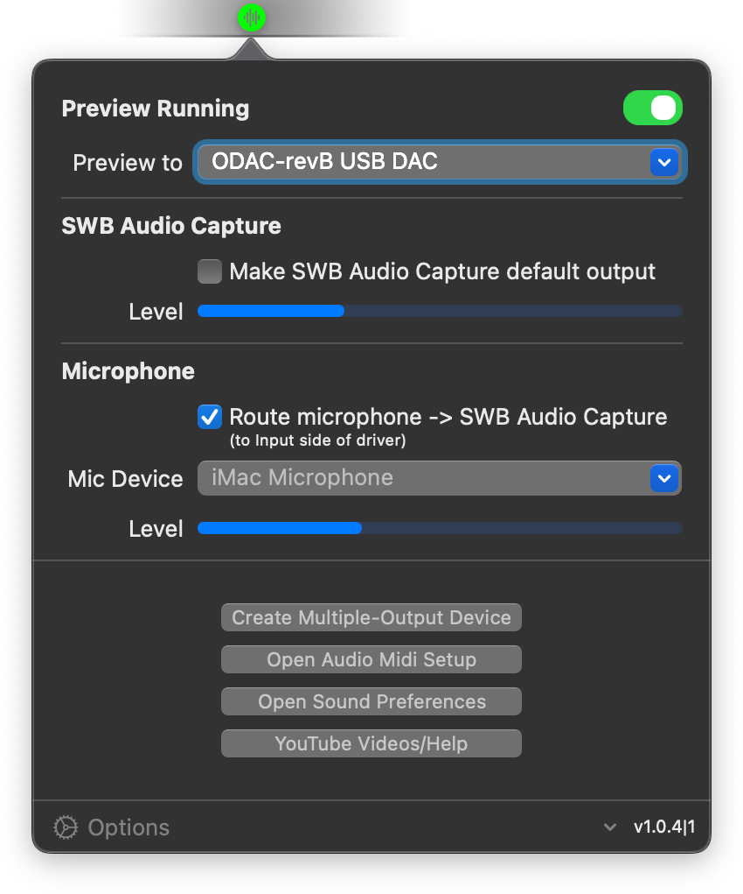
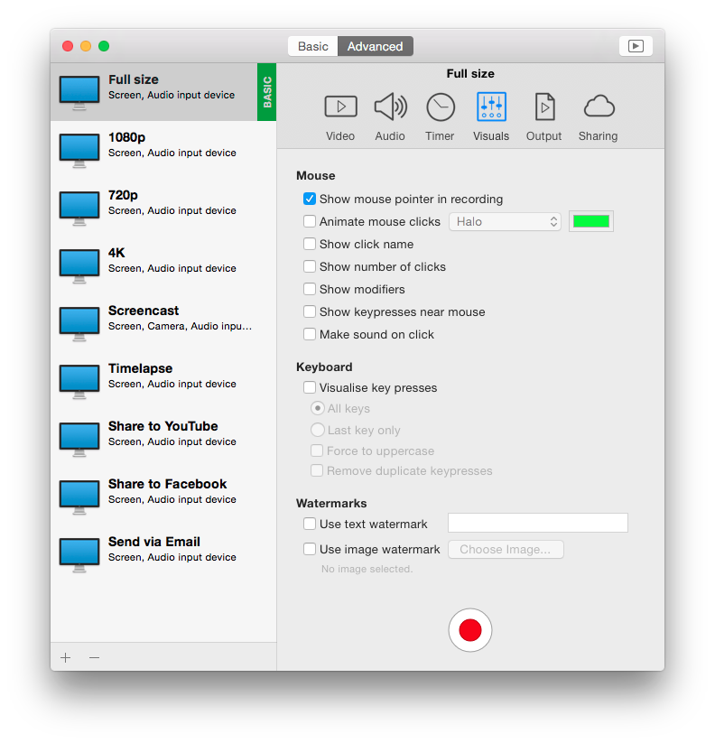
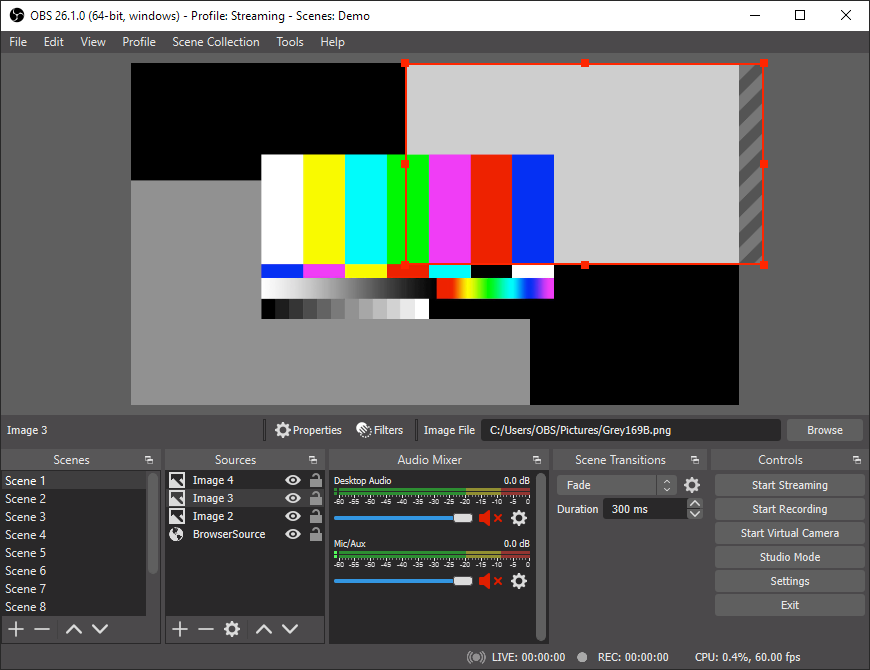

В macOS из коробки нет возможности записать системный звук. При записи звонка сторонними приложениями будет слышен только ваш микрофон, при стриминге игры видео будет без звука, запись онлайн трансляции с экрана будет как немое кино. Исключение - Zoom. При показе экрана он умеет перехватывать системный звук. А Discord и Telegram - нет.

Я расскажу о найденных мной решениях и в конце поделюсь [впечатлениями об упомянутых программах][1].

[1]: #приложения

> TL;DR Для стриминга экрана через [OBS][2] хватит бесплатного [BlackHole][3].  
> Если вам нужна запись звонков, то посмотрите [SWB Audio][4]. Перед покупкой обязательно попробуйте его в своих сценариях.  
> Для сложных кейсов - только [Loopback][5].

[2]: #obs
[3]: #blackhole
[4]: #swb-audio
[5]: #loopback

# Захват аудио

Самое простое - перехватить весь системный звук и куда-то его направить. С этим справится [BlackHole][3] (бесплатно) или [VB-Cable][6] (бесплатно). Эти программы создают виртуальный звуковой интерфейс, который транслирует на выход то, что он получил на вход. Я буду называть их аудио-мостом.

[6]: #vb-cable


После установки выбираем нужно в приложении Audio MIDI Setup создать Multi-Output Device и выбрать в нем интерфейс аудио-моста и наушники или колонки. Без Multi-Output Device звук будет идти только на одно устройство. У вас не будет записи или вы не будете слышать системный звук.

Далее в настройках звука выберите в устройствах воспроизведения Multi-Output Device. В приложении для записи укажите аудио-мост в качестве микрофона.

MacOS позволяет дублировать звук на несколько устройств, но не умеет нормально собирать его с нескольких источников. Поэтому такая схема работает, когда вам не нужна запись микрофона или приложение самое поддерживает работу с несколькими записывающими устройствами. Например, как OBS. То есть для стриминга вполне подходит.



Хуже, когда приложение умеет работать только с одним источником звука и в него нужно передать системный звук и звук с микрофона. Мне как раз такое потребовалось во время онлайн урока по вокалу. Преподавателю нужно слышать мелодию и мой голос, чтобы оценить качество выполнения упражнения. Мелодию я запускаю у себя, чтобы не было лишнего лага.

Для решения этой задачи я на коленке собрал схему ниже. Установил две программы-аудио-моста. На первый аудио-мост завел системный звук. В OBS завел первый мост и микрофон разными устройствами. Включил мониторинг аудио-интерфейсов, OBS дублирует входящий сигнал на указанное устройство воспроизведения. В качестве монитора указал Multi-Output Device с наушниками и вторым аудио-мостом. В приложения для звонка выбрал второй аудио-мост в качестве микрофона.

Получилось дешево и сердито. Чтобы схема работала, нужно держать OBS включенным. Что неудобно.



При подготовке поста я узнал о [SWB Audio][4] ($12 в год). Оно уже умеет добавлять к выходному сигналу звук с микрофона. Но перед покупкой обязательно протестируйте SWB Audio на своих сценариях. Чтобы вас не постигло разочарование, как меня.

У меня внешний звуковой интерфейс Focusrite Scarlett Solo. У него два входных канала, для микрофона и линейный вход для музыкального инструмента. ОС воспринимает их как два отдельных канала, левый и правый. На момент написания поста SWB Audio не позволяет трансформировать сигнал в моно. Поэтому мои собеседники могли слышать меня только в левом ухе.




Выходом для меня стал [Loopback][5] ($99 + $20 налогов). Который умеет создавать любое количество виртуальных интерфейсов, забирать звук с отдельных приложений, маршрутизировать аудио каналы и сохранять их как отдельные схемы, которые можно включать или отключать по мере необходимости. Если ваши задачи выходят за рамки простого захвата системного звука, то я не знаю варианта лучше Loopback.



# Приложения

## BlackHole

Виртуальный интерфейс аудио-мост. Без интерфейса для управления или мониторинга сигнала. Ничего лишнего, просто работает.

Единственное приложение, которое не запросило у меня разрешения на загрузку своего драйвера в Security & Privacy. Я его устанавливал последним из всего списка приложений. Потому возможно, BlackHole переиспользовал ранее поставленный драйвер.

Проект с [открытым исходным кодом][7]. Streamlabs [рекомендуют][8] его для использования. Скачать можно [подписавшись на рассылку][9] или через Homebrew.

```bash
brew install blackhole-2ch
brew install blackhole-16ch
```

[7]: https://github.com/ExistentialAudio/BlackHole
[8]: https://existential.audio/blackhole/
[9]: https://streamlabs.com/content-hub/post/capturing-desktop-audio-in-streamlabs-obs-for-mac

## VB-Cable

Виртуальный интерфейс аудио-мост. Через графический интерфейс можно посмотреть наличие сигнала. Если нужно больше одного интерфейса, можно поставить еще четыре (отдельными приложениями). При установке требует разрешить загрузку своего драйвера.

Скачать можно на [сайте разработчика][10].



[10]: https://vb-audio.com/Cable/

## Loopback

Полноценный машрутизатор звука. Стоит $99 + локальные налоги $20, итого - $119.

Позволяет снимать как весь системный звук через аудио-мост, так и звук с отдельных приложений. Смешивать каналы как угодно. Создавать несколько виртуальных интерфейсов под разные задачи.

Для нестандартных задач - must have. Я могу направить в OBS только звук голосового чата. В Zoom микрофон и музыкальный плеер. В запись QuickTime Player весь системный звук. Продублировать левый канал звуковой карты, там у меня микрофон, на каждый исходящий канал. Могу мониторить исходящий звук.

Все программы разработчика требуют [установки Audio Capture Engine][11]. Для этого придется перезагрузиться в Recovery enironment и разрешить в Security Policy установку kernel extension'ов от одобренных разработчиков.

Скачать и купить можно на [сайте разработчика][12].



[11]: https://rogueamoeba.com/support/knowledgebase/?showArticle=ACE-BigSur
[12]: https://rogueamoeba.com/loopback/


## SWB Audio Capture

Виртуальный интерфейс аудио-мост, который используют приложения [SWB Audio][4] и [iShow Instant][13]. Цена зависит от используемой программы. Без активной лицензии, драйвер периодически подмешивает watermark сообщение в выходной аудио поток. При установке требует разрешить загрузку своего драйвера.

Для захвата звука в macOS [документация OBS][14] ссылается на [форум][15]. Там ссылка на ["101% free" приложение][16], где нас встречает гигантский баннер "Обновились на BigSur? Старое приложение не работает, качайте [SWB Audio][4] (за $12 в год)". Но раньше баннера не было (или я его проигнорировал) и я скачал устаревший драйвер iShowU Audio Capture. Он не заработал. Погуглил, нашел [iShow Instant][13], который сам обновил драйвер на SWB Audio Capture.

На [нулевом стриме DevOps Гаража][17] узнал, что без лицензии драйвер подмешивает в выход фразу "SWB Audio Capture is not registered". На [первом стриме DevOps Гаража][18] я узнал, что купленный iShow Instant нужно держать запущенным, иначе драйвер также подмешивает ту же фразу.

[13]: #ishow-instant
[14]: https://obsproject.com/wiki/OBS-Studio-Quickstart#2-set-up-your-audio-devices
[15]: https://obsproject.com/forum/resources/os-x-capture-audio-with-ishowu-audio-capture.505/
[16]: https://support.shinywhitebox.com/hc/en-us/articles/204161459-Installing-iShowU-Audio-Capture
[17]: https://www.youtube.com/watch?v=FvmqlHzP4-s
[18]: https://www.youtube.com/watch?v=rVxvF0vrXS4

### SWB Audio

Приложение для захвата звука поверх аудио-моста [SWB Audio Capture][19] за $12 в год. Активирует драйвер SWB Audio Capture.

Умеет захватывать микрофон, но не умеет управлять каналами. Из-за этого меня собеседники слышат только левым ухом. У меня внешняя звуковая карта, где левый канал - микрофон, а правый - музыкальный инструмент.

Позволяет мониторить выходную дорожку и микрофон. У меня работает с заметной задержкой.

Скачать можно на [сайте разработчика][20].



[19]: #swb-audio-capture
[20]: https://shinywhitebox.com/swb-audio-app

### iShow Instant

Приложение для записи экрана. Активирует драйвер [SWB Audio Capture][19]. Стоит $24 + $4.8 локальных налогов, итого - $28.8. Разово.

К сожалению, не умеет передавать микрофон в выход, только записывать. Также при записи захватывает сигнал с аудио-моста. Можно из входного левого канала микрофона сделать моно сигнал и его будет слышно с обеих сторон. Для правого так тоже можно =)

Подойдет для записи экрана, для стриминга через OBS. Но не более.

Скачать можно на [сайте разработчика][21].



[21]: https://shinywhitebox.com/ishowu-instant

## OBS

Бесплатное приложение для записи экрана и стриминга. Со своей задачей справляется хорошо. Есть куча расширенний.

В статье я использовал OBS для маршрутизации звука на коленке. С этим он справляется, но рекомендовать для этого не буду.

Скачать можно с [официального сайта][22]. Также доступна [сборка от Streamlabs][23]. Базовая функциональность также бесплатно, а вот за дополнительные фичи попросят денежку.



[22]: https://obsproject.com/
[23]: https://streamlabs.com/
